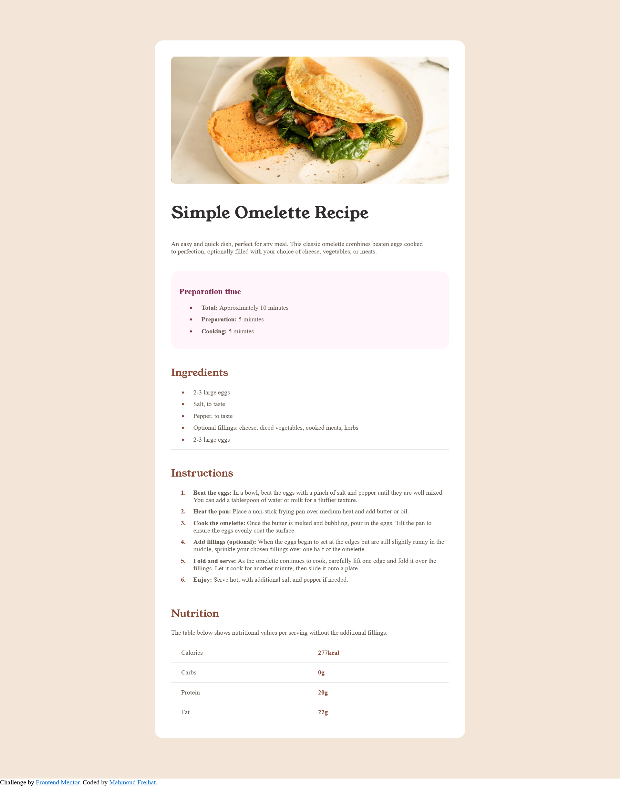
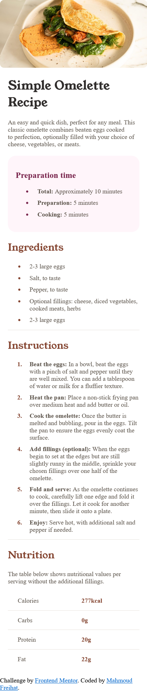

# Frontend Mentor - Recipe page solution

This is a solution to the [Recipe page challenge on Frontend Mentor](https://www.frontendmentor.io/challenges/recipe-page-KiTsR8QQKm). Frontend Mentor challenges help you improve your coding skills by building realistic projects. 

## Table of contents

- [Overview](#overview)
  - [Screenshot](#screenshot)
  - [Links](#links)
  - [Built with](#built-with)

## Overview
In this project, I created a simple omelette recipe page using HTML and CSS. The page layout is responsive and adjusts seamlessly to different screen sizes.

![]
### Screenshot

### Links

- Solution URL: (https://github.com/mahmood100100/Recipe-page/tree/solution)
- Live Site URL:(https://github.com/mahmood100100/Recipe-page)

### Built with

- Semantic HTML5 markup
- CSS custom properties
- Flexbox
- CSS Grid
- Media queries for responsive design

